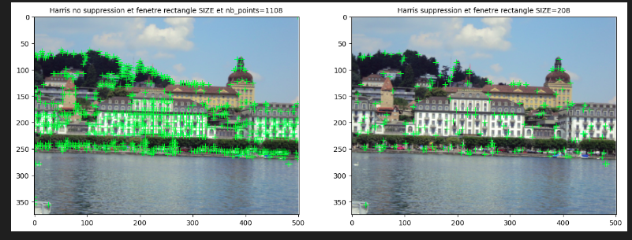
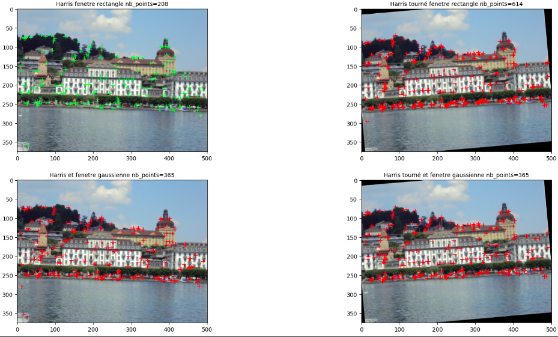
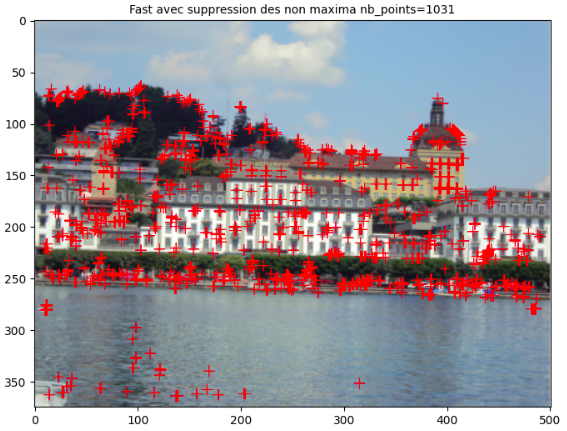
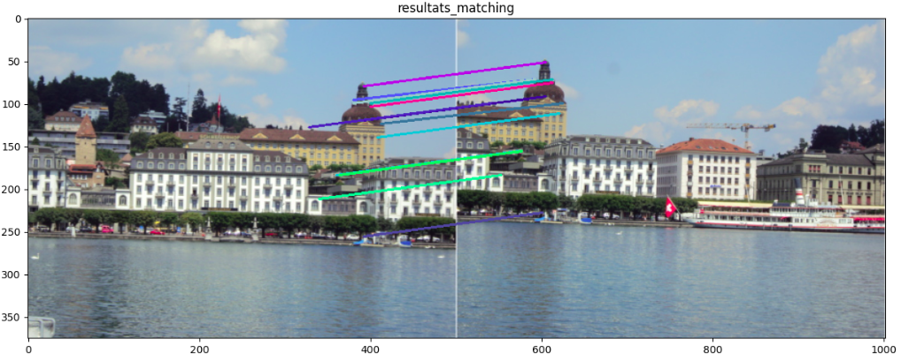
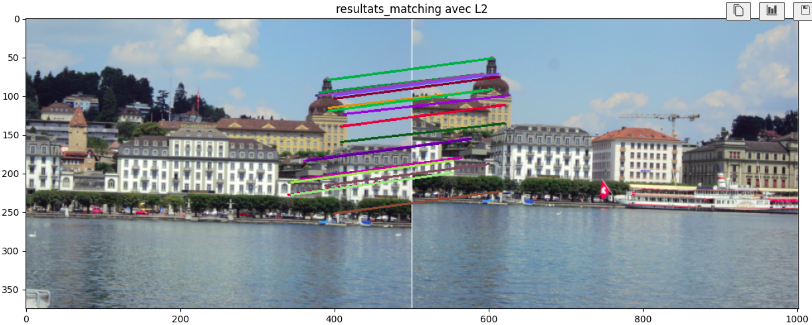
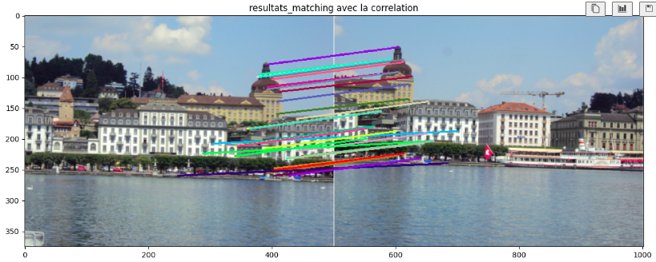
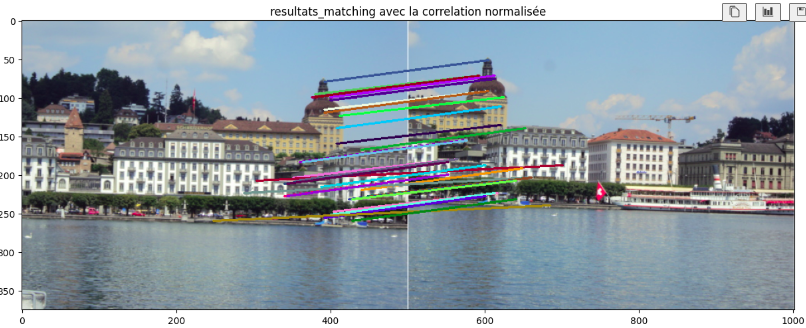

# Detection of key points

This practical is about detecting key points in images. 2 methods are implemented :

- Harris corner detector

- FAST corner detector

The two implemententations will be discussed (see the jupyter notebook), as well as the impact of the parameters on the results.

# Matching of key points

Once the key points are detected, we need to match them between two images. The matching is done by computing the distance between the descriptors of the key points. 

- step 1 : compute the descriptors of the key points
- step 2 : compute the distance between the descriptors
- step 3 : match the descriptors

#  Infuence of the metrics

- L2 distance

- Correlation

- Cross-correlation

